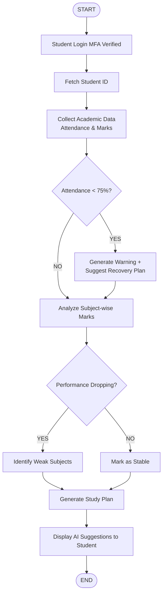
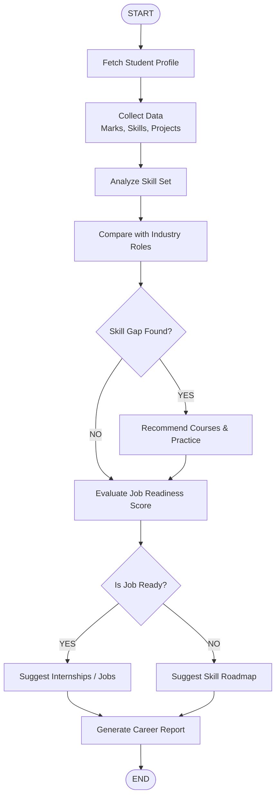
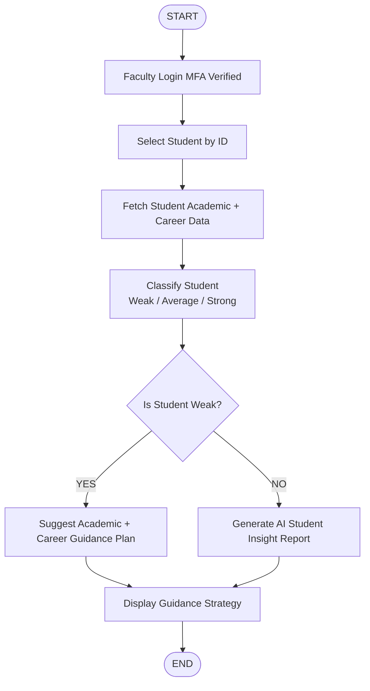
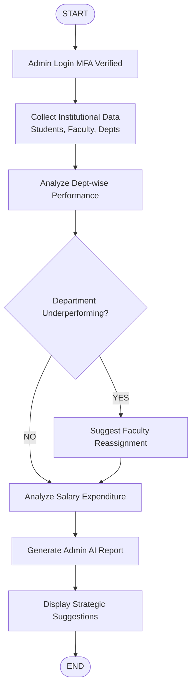
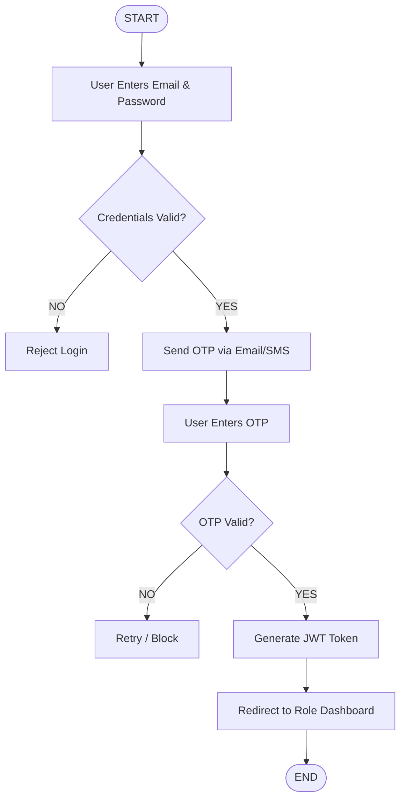

# VITAM CMS - AI System Flowcharts

This document serves as the **Record Notebook diagrams** for your project. You can draw these exactly as shown or take screenshots of rendered Mermaid diagrams.

## 1. Student AI Agent - Academic Analysis Flowchart
**Purpose:** Analyze student academic data and guide learning.

## 2. Career Guidance AI Flowchart
**Purpose:** Guide students from learning to job placement.

## 3. Faculty AI Agent - Student Guidance
**Purpose:** Help faculty guide students based on data classification.

## 4. Admin AI Agent - Institutional Statistics
**Purpose:** Provide complete control and analytics to the Administrator.

## 5. MFA & Secure Login Flowchart
**Purpose:** Secure authentication workflow.

